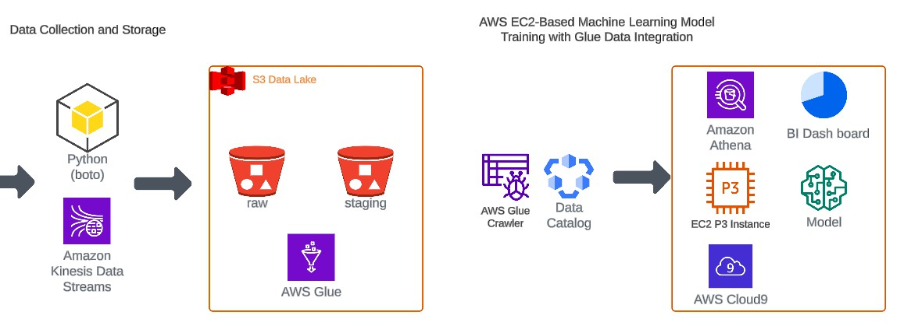

## AWS Glue Series by JA (johnny-alin-data.com)
 
## AWS Certificate
- [AWS Certified Data Engineer – Associate](https://www.credly.com/badges/6778cea1-3f23-4b02-afaa-8586da0f3b3c/public_url)
- [AWS Certified Cloud Practitioner](https://www.credly.com/badges/9539268b-5bd3-41dc-b87d-4e8de0a255ec)

        
=====================================================================================         
 

        

- [Unlocking the Power of AWS Glue Crawlers for Effective ETL Processes Part 1](https://www.linkedin.com/pulse/unlocking-power-aws-glue-crawlers-effective-etl-processes-johnny-hung-tby2f/?trackingId=j0z0inlZQXiHtyqpvpUpUg%3D%3D)
- [Unlocking the Power of AWS Glue Crawlers for Effective ETL Processes Part 2](https://www.linkedin.com/pulse/unlocking-power-aws-glue-crawlers-effective-etl-processes-johnny-hung-why2f/?trackingId=UFHe34NfT%2BS1%2BIzl0BZWIQ%3D%3D)
- [Unlocking the Power of AWS Glue ETL: Transforming and Organizing Data for Analysis (Part 3)](https://www.linkedin.com/pulse/unlocking-power-aws-glue-etl-transforming-organizing-data-johnny-hung-yt2zf/?trackingId=JuykAErsR%2F6iyqqPqkc6cA%3D%3D)
- [Optimizing AWS Glue ETL Jobs: Transitioning to Separate S3 Buckets for Raw and Analytics Layers (Part 4)](https://www.linkedin.com/pulse/optimizing-aws-glue-etl-jobs-transitioning-separate-s3-johnny-hung-ok1ff/?trackingId=G4%2FqaSkQG82Mt6MFKmUZTA%3D%3D)
- [Automating ETL with AWS Glue: Setting Up Daily Schedules and Auto-Crawlers (Part 5)](https://www.linkedin.com/pulse/automating-etl-aws-glue-setting-up-daily-schedules-part-wei-che-hung-2vxof/?trackingId=wPjJyC2SRmmIieI7ZegIcA%3D%3D)

- [Visualizing Your AWS Data Lake with Amazon QuickSight (Part 6) ](https://www.linkedin.com/pulse/visualizing-your-aws-data-lake-amazon-quicksight-wei-che-hung-vjulf/?trackingId=6Gv3accOSlSTMKyTZ8YXDg%3D%3D)
         
         
         
         
         
         
         
         
         
         ___        ______     ____ _                 _  ___  
        / \ \      / / ___|   / ___| | ___  _   _  __| |/ _ \ 
       / _ \ \ /\ / /\___ \  | |   | |/ _ \| | | |/ _` | (_) |
      / ___ \ V  V /  ___) | | |___| | (_) | |_| | (_| |\__, |
     /_/   \_\_/\_/  |____/   \____|_|\___/ \__,_|\__,_|  /_/ 
 ----------------------------------------------------------------- 

----
- 2024-05-28 updated gmaing.script to generated yyyymmdd __ name data 
- 2024-07-21 updated the article-part1 for genrated data and upload process note

Hi there! Welcome to AWS Cloud9!

To get started, create some files, play with the terminal,
or visit https://docs.aws.amazon.com/console/cloud9/ for our documentation.

Happy coding!

## Johnny Updated Article One Generated Data 
---

## Run python script to generated one day with specific rows you want

python generate_data.py 2024-01-01 2000

## Run the script to auto gnerated the Range of the days and random rows-range 
source run_generator_domain_game_slot_with_argument.sh 

## Run Auto Upload Data to S3 
source run_data_etl_to_s3_raw.sh

## Part 2 later ...

